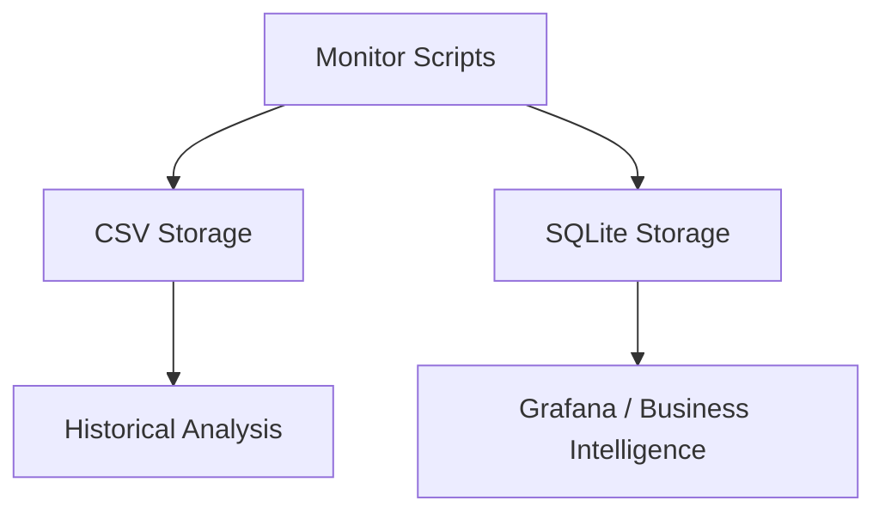

# Monitor - Home Automation Monitoring Suite

A comprehensive monitoring solution for home automation systems with energy meter polling, weather data collection, and SQLite storage.

## Quick Start

### Prerequisites

This project uses [uv](https://github.com/astral-sh/uv) for dependency management.

```bash
# Install dependencies and create virtual environment
uv sync

# Create .env file with required configuration
cp .env.example .env
# Edit .env with your credentials
```

## Configuration

### Required .env File

Create a `.env` file in the monitor directory:

```ini
# Evohome Credentials
EVOHOME_EMAIL=your_email@example.com
EVOHOME_PASSWORD=your_password_here

# OpenWeatherMap API
OPENWEATHER_API_KEY=your_api_key_here
```

### API Configuration

**Energy Meter:**
Edit `API_URL` in `src/monitor_suite/energymeter.py`:
```python
API_URL = "http://p1meter-231dbe.local./api/v1/data"
```

## Features and Usage

### 1. Energy Meter Polling

Continuously polls P1 Energy Meter API and logs data to SQLite and CSV.

**Features:**
- Configurable polling intervals (10s to 120m)
- CSV output with automatic flattening of nested JSON
- SQLite database for time-series analysis
- On-screen table display with key metrics
- Interactive keyboard controls ('L' for header)

**Usage:**
```bash
# Default poll (1 minute)
uv run monitor-energy
```

### 2. Weather Data Collection

Fetches weather data from OpenWeatherMap API and correlates with heating data.

**Features:**
- OpenWeatherMap API integration
- CSV and SQLite logging with timestamps
- Configurable polling intervals
- Weather condition tracking

**Usage:**
```bash
# Default poll (10 minutes)
uv run monitor-weather
```

### 3. Room Temperature Polling

Fetches temperature data from Honeywell Evohome API.

**Features:**
- Evohome TCC API integration
- CSV and SQLite logging for room-level data
- Standardized CLI arguments

**Usage:**
```bash
# Default poll (5 minutes)
uv run monitor-evohome
```

### Data Inspection

| Database | Description |
|---------|-------------|
| `sqlite3 data/energy.db` | Inspect energy data |
| `sqlite3 data/rooms.db` | Inspect rooms data |
| `sqlite3 data/weatherdata.db` | Inspect weather data |

## Folder Structure

```
monitor/
├── pyproject.toml     # Project metadata and dependencies
├── uv.lock           # Frozen dependencies
├── .env               # Environment variables (required)
├── .gitignore         # Git ignore file
├── logs/              # Log directory
├── src/               # Source code
│   └── monitor_suite/ # Core package
│       ├── energymeter.py
│       ├── openweathermap.py
│       └── evohome.py
├── data/              # Data storage (SQLite & CSV files)
│   ├── energy.db / energy.csv
│   ├── rooms.db / rooms.csv
│   └── weatherdata.db / weatherdata.csv
├── tests/             # Unit tests
└── docs/              # Documentation
```

## Data Flow



## Testing

Run tests using `uv`:
```bash
uv run pytest
```

## Related Projects

- **[evohome-async](../evohome-async/)** - Async client for Honeywell TCC API
- **SQLite** - Relational database
- **Grafana** - Visualization platform
- **Home Assistant** - Home automation platform
