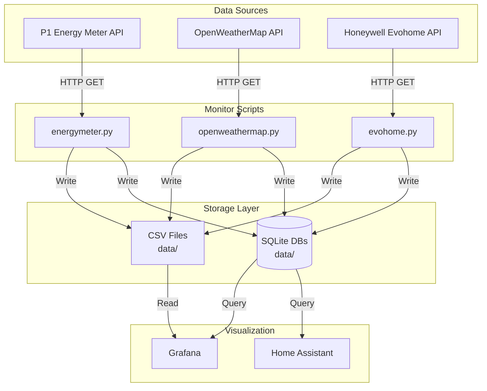

# Monitor Architecture

## Overview

The **dvm-mesura** suite is a comprehensive monitoring and data collection system for home automation. It provides tools for polling various data sources (energy meters, weather APIs), storing data in both CSV and time-series databases (SQLite), and enabling visualization and analysis.

## System Architecture

### High-Level Architecture



## Component Architecture

### 1. Data Collection Scripts

#### energymeter.py

**Purpose**: Continuously poll P1 Energy Meter API for real-time energy consumption data.

**Architecture**:
```
┌─────────────────────────────────────────────────────┐
│           poll_energymeter.py                       │
├─────────────────────────────────────────────────────┤
│  Main Loop                                          │
│  ├─ Interval Timer (10s - 120m)                    │
│  ├─ API Poller                                      │
│  │  └─ HTTP GET to P1 Meter API                    │
│  ├─ Data Processor                                  │
│  │  ├─ JSON Flattener                              │
│  │  ├─ Field Exclusion (external)                  │
│  │  └─ Timestamp Addition                          │
│  ├─ CSV Writer                                      │
│  │  ├─ Header Management                           │
│  │  ├─ Append/Overwrite Logic                      │
│  │  └─ File I/O                                    │
│  └─ Display Manager                                 │
│     ├─ Table Formatter                             │
│     ├─ Keyboard Handler ('L' key)                  │
│     └─ Screen Refresh                              │
└─────────────────────────────────────────────────────┘
```

**Key Functions**:
- `parse_interval()` - Parse interval strings (e.g., "10m" → 600s)
- `fetch_energy_data()` - HTTP GET from P1 Meter API
- `flatten_data()` - Recursively flatten nested JSON structures
- `write_to_sqlite()` - Write data points to local SQLite database
- `display_table()` - Format and display data table

**Data Flow**:
```
API Response (JSON)
    ↓
Flatten Nested Structures
    ↓
Exclude Fields (external)
    ↓
Add Timestamp
    ↓
┌───────────┬────────────────┐
│           │                │
▼           ▼                ▼
CSV File    SQLite DB    Screen Display
```

#### openweathermap.py

**Purpose**: Collect weather data from OpenWeatherMap API for correlation with heating data.

**Architecture**:
```
┌─────────────────────────────────────────────────────┐
│        poll_openweathermap.py                       │
├─────────────────────────────────────────────────────┤
│  Main Loop                                          │
│  ├─ Interval Timer (configurable)                  │
│  ├─ API Poller                                      │
│  │  ├─ HTTP GET to OpenWeatherMap                  │
│  │  └─ API Key Authentication                      │
│  ├─ Data Processor                                  │
│  │  ├─ Weather Data Extraction                     │
│  │  ├─ Temperature Conversion                      │
│  │  └─ Condition Mapping                           │
│  └─ CSV Writer                                      │
└─────────────────────────────────────────────────────┘
```

**Data Points Collected**:
- Temperature (current, feels like, min, max)
- Humidity
- Pressure
- Wind speed and direction
- Cloud coverage
- Weather conditions
- Sunrise/sunset times

#### evohome.py

**Purpose**: Fetches temperature data from Honeywell Evohome API.

**Architecture**:
```
┌─────────────────────────────────────────────────────┐
│      poll_evohome_standalone.py                    │
├─────────────────────────────────────────────────────┤
│  Main Loop                                          │
│  ├─ Token Manager (OAuth authentication)            │
│  ├─ API Poller                                      │
│  │  └─ HTTP GET to Evohome TCC API                  │
│  ├─ Data Processor                                  │
│  │  └─ Room Temperature Extraction                  │
│  ├─ CSV Writer                                      │
│  ├─ SQLite Writer                                   │
│  └─ Display Manager                                 │
└─────────────────────────────────────────────────────┘
```


### 3. Data Storage Layer

#### CSV Storage

**Format**: Flat CSV files with headers

**Structure**:
```csv
timestamp,field1,field2,field3,...
2025-01-15T10:00:00Z,value1,value2,value3,...
2025-01-15T10:10:00Z,value1,value2,value3,...
```

**Characteristics**:
- Human-readable
- Easy to import/export
- Compatible with spreadsheet applications
- No query capabilities
- Linear growth

**Use Cases**:
- Backup storage
- Data portability
- Quick inspection
- Offline analysis

#### SQLite Storage

**Format**: Relational database (SQL)

**Characteristics**:
- Optimized for relational and time-series queries
- Single-file storage
- No external server requirement
- Fast local access

**Schema Design**:

**Energy Meter Table**:
```sql
CREATE TABLE IF NOT EXISTS readings (
    timestamp TEXT PRIMARY KEY,
    active_tariff INTEGER,
    gas_m3 REAL,
    power_kwh REAL,
    ...
);
```

## Data Flow Patterns

### 1. Real-Time Polling Pattern

```
┌──────────┐
│  Timer   │
└────┬─────┘
     │ Interval Trigger
     ▼
┌──────────┐
│ API Call │
└────┬─────┘
     │ JSON Response
     ▼
┌──────────┐
│ Process  │
└────┬─────┘
     │ Structured Data
     ├─────────────┬──────────────┐
     ▼             ▼              ▼
┌─────────┐  ┌──────────┐
│   CSV   │  │  Display │
└─────────┘  └──────────┘
```


### 3. Dual-Write Pattern

```
┌──────────┐
│   Data   │
└────┬─────┘
     │
     ├─────────────┐
     ▼             ▼
┌─────────┐  ┌──────────┐
│   CSV   │  │  SQLite  │
│ (Backup)│  │ (Primary)│
└─────────┘  └──────────┘
```

## Configuration Management

### Environment Variables

All scripts use a consistent environment variable pattern:

```ini
# Standard .env variables for connectivity
EVOHOME_EMAIL=...
EVOHOME_PASSWORD=...
OPENWEATHER_API_KEY=...
```

### Configuration Loading

```python
# Priority order:
1. Environment variables (highest)
2. .env file
3. Default values (lowest)
```

### Configuration Validation

All scripts validate configuration on startup:
- Required fields present
- Valid formats
- Connectivity tests
- Permission checks

## Error Handling Strategy

### Retry Logic

```python
# API calls use exponential backoff
retry_delays = [1, 2, 4, 8, 16]  # seconds
max_retries = 5
```

### Error Categories

1. **Transient Errors** (retry)
   - Network timeouts
   - Temporary API unavailability
   - Rate limiting

2. **Configuration Errors** (fail fast)
   - Invalid credentials
   - Missing required fields
   - Invalid formats

3. **Data Errors** (skip and log)
   - Invalid JSON
   - Missing fields
   - Type mismatches

### Logging Strategy

```python
# Log levels:
- DEBUG: Detailed execution flow
- INFO: Normal operations
- WARNING: Recoverable issues
- ERROR: Failed operations
- CRITICAL: System failures
```

## Performance Considerations

### Polling Intervals

**Energy Meter**:
- Minimum: 10s (high-frequency monitoring)
- Recommended: 5-10m (balance between detail and load)
- Maximum: 120m (low-frequency monitoring)

**Weather**:
- Minimum: 10m (API rate limits)
- Recommended: 30-60m (sufficient for correlation)
- Maximum: 120m (basic tracking)

### Data Volume Estimates

**Energy Meter** (10m interval):
- CSV: ~10 KB/day, ~3.6 MB/year


### Network Security

- HTTPS for API calls
- Local network isolation
- Firewall rules

### Data Privacy

- No PII in logs
- Sanitized error messages
- Secure file permissions
- Encrypted backups (recommended)

## Integration Points


### Grafana

**Dashboard Panels**:
- Energy consumption over time
- Weather correlation graphs
- Temperature trends
- Cost analysis
- Anomaly detection

**Data Sources**:
- SQLite
- CSV (backup/import)

### evohome-async Integration

The monitor suite complements evohome-async by:
- Providing energy context for heating decisions
- Weather correlation for schedule optimization
- Unified SQLite storage
- Combined visualization

## Extension Points

### Adding New Data Sources

1. Create new polling script following pattern:
   ```python
   # src/dvm_mesura/poll_newsource.py
   - parse_interval()
   - write_to_csv()
   - display_table()
   ```

2. Add documentation in `docs/`
3. Update README.md
4. Add tests if applicable


### Custom Visualizations

1. Create Grafana dashboard
2. Export dashboard JSON
3. Document in `docs/`
4. Share with community

## Deployment Patterns

### Development

```bash
# Local development with file-based storage
uv run mesura-energy --output data/energy.csv --noshow
```

### Production

```bash
# Background service
nohup uv run mesura-energy &
```

### Docker (Future)

```dockerfile
# Containerized deployment
FROM python:3.12-slim
COPY scripts/ /app/scripts/
COPY requirements.txt /app/
RUN pip install -r requirements.txt
CMD ["python", "/app/scripts/poll_energymeter.py"]
```

### Systemd Service (Future)

```ini
[Unit]
Description=Energy Meter Polling Service
After=network.target

[Service]
Type=simple
User=homeautomation
WorkingDirectory=/opt/monitor
ExecStart=/usr/bin/python3 scripts/poll_energymeter.py -o data/energy.csv
Restart=always

[Install]
WantedBy=multi-user.target
```

## Monitoring and Observability

### Health Checks

- API connectivity
- Disk space
- Process status

### Metrics

- API call success rate
- Data points written
- Error rate
- Processing latency

### Alerts

- API failures
- Disk space warnings
- Anomalous data values

## Future Enhancements

### Planned Features

- Docker containerization
- Systemd service files
- Web dashboard for configuration
- Real-time alerting
- Machine learning anomaly detection
- Multi-location support
- Data export/import tools
- API rate limiting
- Automatic backup rotation

### Scalability Improvements

- Distributed polling
- Load balancing
- Horizontal scaling
- Caching layer
- Message queue integration

## Related Documentation

- [User Guide](UserGuide.md) - Comprehensive usage guide
- [Poll Energy Meter](PollEnergyMeter.md) - Energy meter details
- [Poll Rooms](PollRooms.md) - Room temperature details
- [Poll Weather](PollWeather.md) - Weather polling guide
