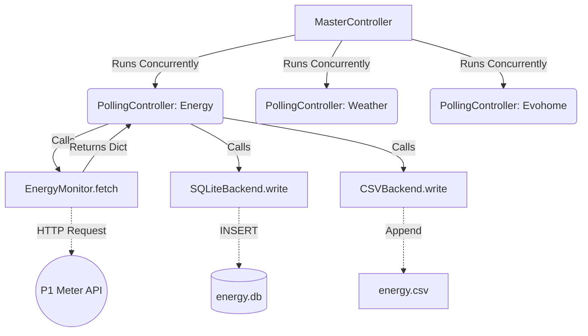

# Home Automation Monitor Architecture

This document describes the architecture of the `dvm_mesura` Python package, a unified home automation monitoring suite.

## High-Level Overview

The system collects data from various sources (smart energy meters, weather APIs, smart thermostats) and stores it locally for historical analysis and dashboarding (e.g., via Grafana).

Previously consisting of standalone scripts managed by `tmux` and `cron`, the architecture has been refactored into a single, unified, asynchronous Python application. This ensures robust error handling, shared configurations, and efficient data processing.

## Core Components

The application is structured into four main components:

### 1. Main Entrypoint (`dvm_mesura.main`)
The entry point parses command-line arguments and loads environment variables (from `.env`). It handles Dependency Injection, instantiating the required Monitors and Backends based on user configuration, and then starts the Master Controller execution loop.

### 2. Controllers (`dvm_mesura.core.controller`)
Controllers orchestrate the repetitive polling.
*   **`PollingController`**: Manages the infinite loop for a single Monitor. It sleeps for the configured interval, calls the Monitor's `fetch()` method, and dispatches the resulting data to all configured Backends.
*   **`MasterController`**: Aggregates multiple `PollingController` instances and runs them concurrently using `asyncio.gather()`.

### 3. Monitors (`dvm_mesura.monitors.*`)
Monitors are responsible for fetching data from external APIs or hardware. They implement a standard interface requiring an async `fetch()` method that returns a dictionary of data.
*   **`EnergyMonitor`**: Polls a local P1 meter API (`p1meter-231dbe.local.`).
*   **`WeatherMonitor`**: Polls the OpenWeatherMap API for temperature, humidity, and weather conditions based on configured coordinates.
*   **`EvohomeMonitor`**: Polls the Resideo Total Connect Comfort API (via `evohome-async`) to retrieve zone temperatures and setpoints.

### 4. Backends (`dvm_mesura.backends.*`)
Backends handle data storage. They implement a standard interface requiring an async `write(data: dict, source_name: str)` method.
*   **`CSVBackend`**: Appends data to simple CSV files in the configured data directory.
*   **`SQLiteBackend`**: Stores data in structured SQLite databases. This is the primary backend recommended for use with Grafana. It handles automatic schema creation and evolution.

## Data Flow

The following describes a single polling cycle for any given monitor:

1.  The `PollingController` wakes up after its `sleep()` interval.
2.  It calls the `fetch()` method on its assigned `Monitor`.
3.  The `Monitor` makes an asynchronous HTTP request to its target API, parses the JSON response, adds a standardized `timestamp` field (in UTC), and returns a flat dictionary of metric names to values.
4.  The `PollingController` iterates through its assigned list of `Backends`.
5.  It calls `write(data, source_name)` on each `Backend`, passing the fetched dictionary and the string name of the monitor (e.g., "energy").
6.  The `Backend` translates the dictionary into a generic storage format (e.g., inserting a row into a SQLite table).

## Concurrency and Thread Safety

The suite uses Python's `asyncio` to execute multiple monitors simultaneously within a single process. This is critical for preventing slow network requests (e.g., a delayed response from the Evohome cloud API) from blocking the local Energy meter polling.

### Database Thread Safety
While network requests are asynchronous, the standard Python `sqlite3` library is synchronous. Calling its methods directly would block the async event loop.
Furthermore, concurrent script execution (or multiple monitors writing to a shared database simultaneously) can cause `database is locked` errors and data corruption.

To resolve this, the `SQLiteBackend` implements the following safety measures:

1.  **WAL Mode**: During database initialization, `PRAGMA journal_mode=WAL` (Write-Ahead Log) is executed. This enables significantly better concurrent read/write access.
2.  **`asyncio.Lock`**: An async lock prevents multiple coroutines within the application from attempting to write to the same database file at exactly the same time.
3.  **`asyncio.to_thread`**: Actual synchronous `sqlite3` execution calls (like `execute()` and `commit()`) are offloaded to a separate worker thread using `asyncio.to_thread`. This ensures the main async event loop is never blocked by database disk I/O.
